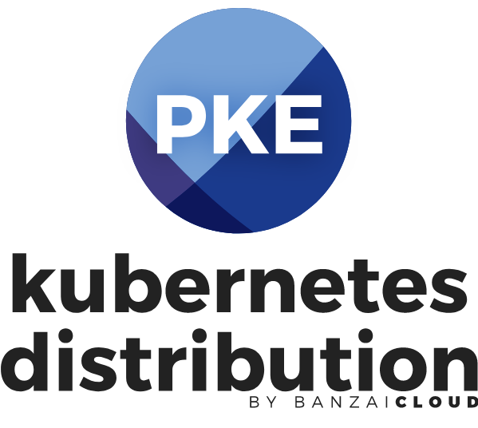

<p align="center"></p>
# Pipeline Kubernetes Engine - PKE

PKE is an extremely simple [CNCF certifed](https://www.cncf.io/certification/software-conformance/#logos) Kubernetes installer and distribution, designed to work on any cloud, VM or bare metal. The `pke` tool supports cloud provider integrations, multi-phased installs (requires only an OS), pre-warmed machine image builds, and more. PKE is the preferred Kubernetes run-time of the [Banzai Cloud Pipeline platform](https://beta.banzaicloud.io/), which supercharges the development, deployment and scaling of container-based applications with native support for multi-, hybrid-, and edge-cloud environments.

If you would like to supercharge your Kubernetes experience using Banzai Cloud Pipeline, check out the free developer beta:
<p align="center">
  <a href="https://beta.banzaicloud.io">
  
  </a>
</p>

## Creating PKE Kubernetes clusters on a Linux distribution

In order to run PKE, you need to meet the following requirements.

### Requirements

#### Operating system

`pke` currently is available for CentOS 7.x, RHEL 7.x. and **Ubuntu 18.04 LTS**.

> We recommend using Ubuntu since it contains a much newer Kernel version. If you need support for an OS not listed above feel free to contact us.

#### Network

A flat network between nodes is required. Port `6443` (K8s API server) should be opened if there is a need to access K8s API externally.

#### The `pke` binary

You can download a particular binary release from the project's release page on [GitHub](https://github.com/banzaicloud/pke/releases). Our guides assume that the executable is available as `pke` in the system PATH.

You can also use the following commands as root to achieve this:


```
curl -vL https://banzaicloud.com/downloads/pke/latest -o /usr/local/bin/pke
chmod +x /usr/local/bin/pke
export PATH=$PATH:/usr/local/bin/
```

> Note that the `pke` tool will install all required dependencies (like CRI, CNI, etc).

### Single-node PKE

This will install a single Kuberentes master node and enables you to run workloads on it.

> At least 2 CPU cores are required and minimum of 512 MB of memory.

Creating a single-node Kubernetes cluster is as simple as running the following command as root:

`pke install single`

### Multi-node PKE

This setup consists a single Kubernetes master and at least one non-master node.

#### Master

> At least 2 CPU cores are required and minimum of 512 MB of memory.

To create the Kubernetes API server:

```bash
export MASTER_IP_ADDRESS=""
pke install master --kubernetes-api-server=$MASTER_IP_ADDRESS:6443
```

>Please get the token and certhash from the logs or issue the `pke token list` command to print the token and cert hash needed by workers to join the cluster.
>

#### Additional nodes

> At least 1 CPU core is required.

Once the API server is up and running you can add as many non-master nodes as needed:

```bash
export TOKEN=""
export CERTHASH=""
export MASTER_IP_ADDRESS=""
pke install worker --kubernetes-node-token $TOKEN --kubernetes-api-server-ca-cert-hash $CERTHASH --kubernetes-api-server $MASTER_IP_ADDRESS:6443
```

### Using `kubectl`

To use `kubectl` and other command line tools on the Kubernetes master, set up its config:

```bash
mkdir -p $HOME/.kube
cp -i /etc/kubernetes/admin.conf $HOME/.kube/config
chown $(id -u):$(id -g) $HOME/.kube/config
kubectl get nodes
```

## Other options

You can create PKE clusters on any of the cloud providers, Vagrant, virtual machines, etc using the `pke` tool or let the [Pipeline platform](https://beta.banzaicloud.io/) do it for you using all the complementary features, such as: centralized log collection, federated monitoring, autoscaling, Vault based secret management, disaster recovery, security scans and a lot more.

- [PKE with Pipeline](https://beta.banzaicloud.io/)
- [PKE on AWS](/docs/aws.md)
- [PKE on Azure](/docs/azure.md)
- [PKE in Vagrant](/docs/vagrant.md)

## Contributing

Thank you for your contribution and being part of our community. Please read [CONTRIBUTING.md](.github/CONTRIBUTING.md) for details on the code of conduct, and the process for submitting pull requests. When you are opening a PR to PKE for the first time we will require you to sign a standard CLA.

## Community

If you have any questions about PKE, and would like to talk to us and the other members of the Banzai Cloud community, please join our [Slack](https://slack.banzaicloud.io/).

## License

Copyright (c) 2017-2019 [Banzai Cloud, Inc.](https://banzaicloud.com)

Licensed under the Apache License, Version 2.0 (the "License");
you may not use this file except in compliance with the License.
You may obtain a copy of the License at

[http://www.apache.org/licenses/LICENSE-2.0](http://www.apache.org/licenses/LICENSE-2.0)

Unless required by applicable law or agreed to in writing, software
distributed under the License is distributed on an "AS IS" BASIS,
WITHOUT WARRANTIES OR CONDITIONS OF ANY KIND, either express or implied.
See the License for the specific language governing permissions and
limitations under the License.
